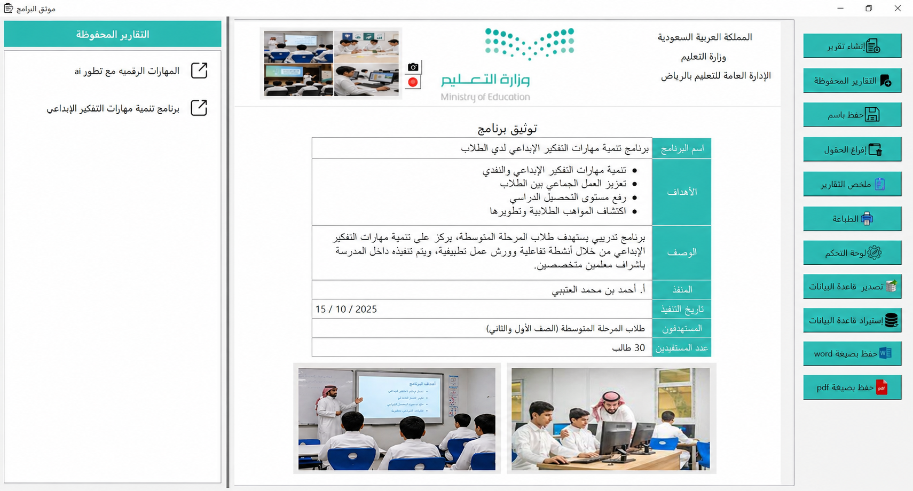
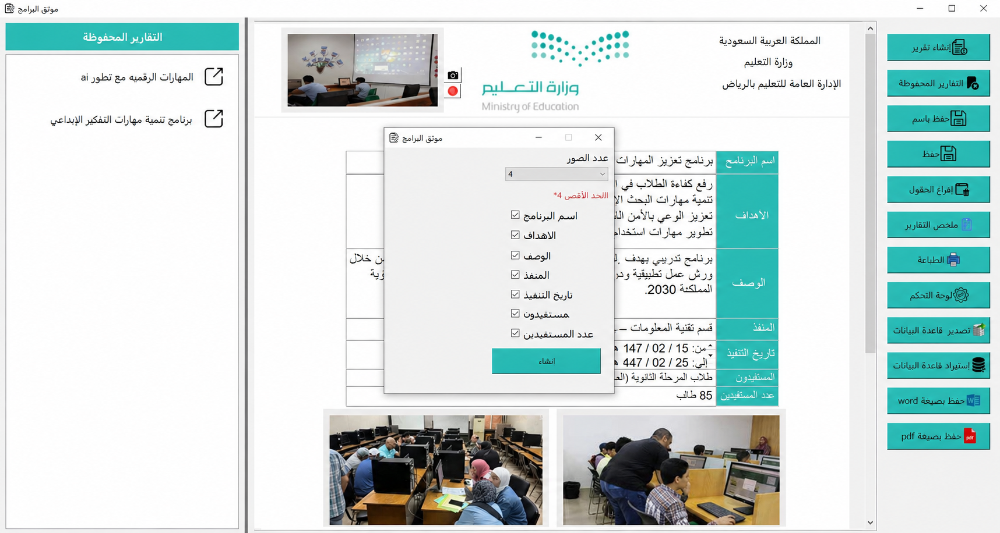
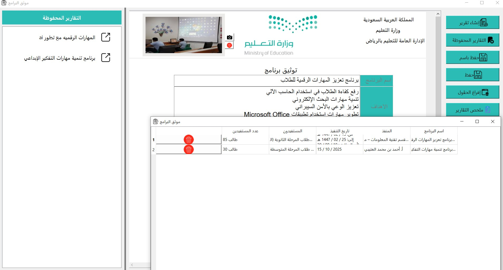
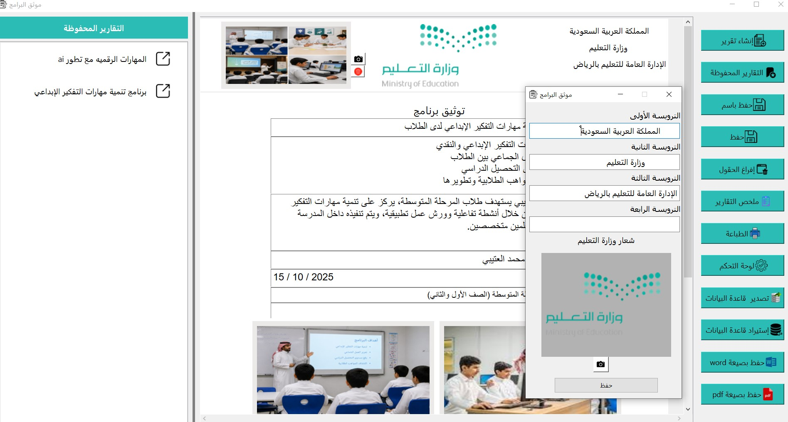
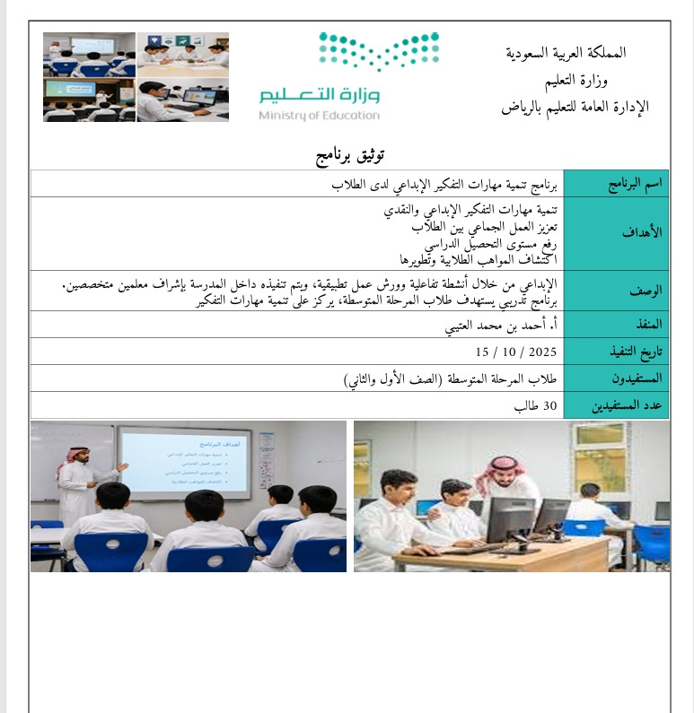
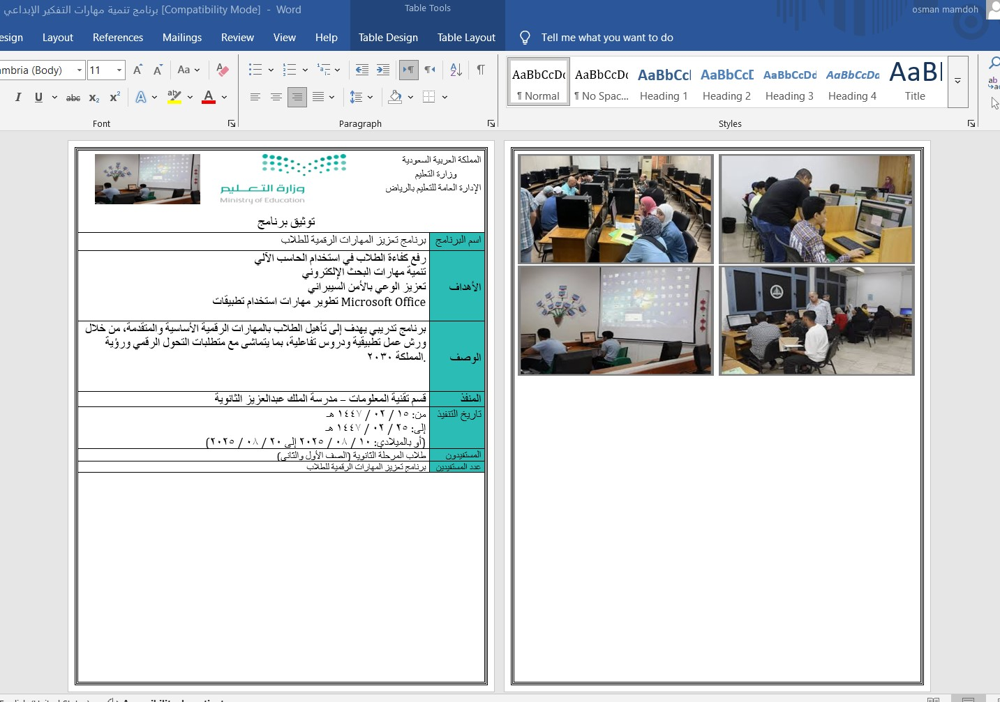
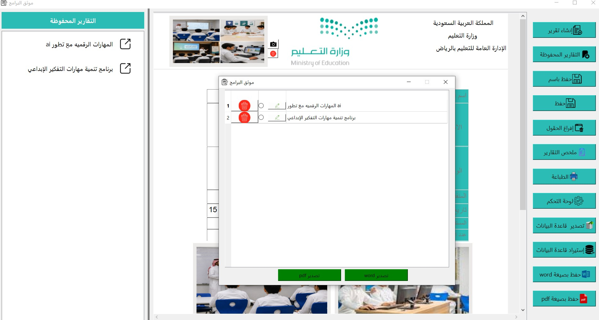
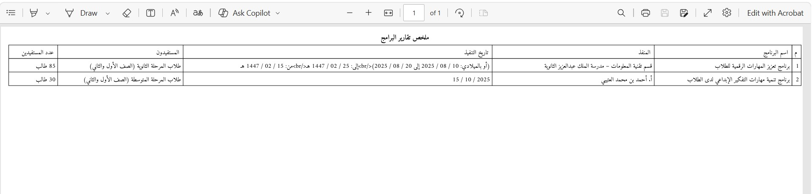
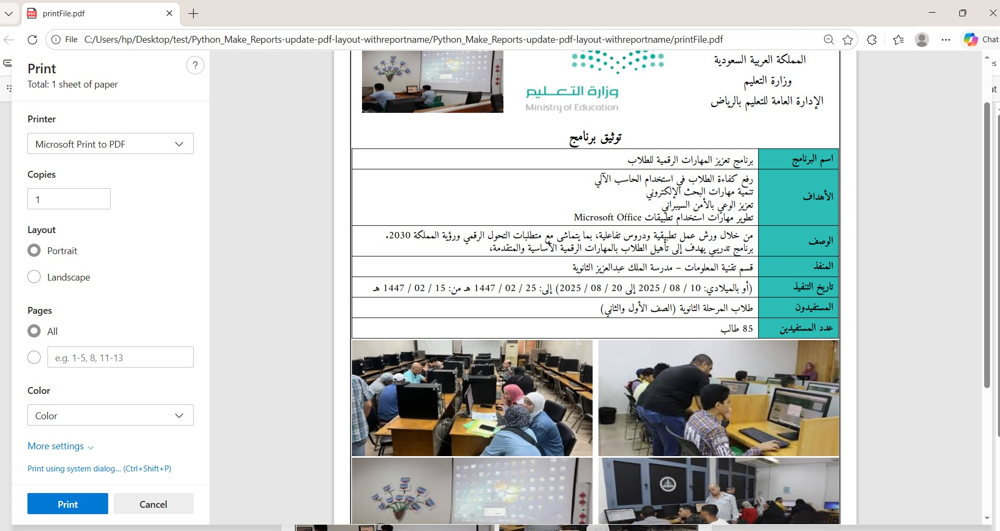

# 📚 موثق البرامج — Educational Programs Documentation System

A desktop application built with Python for documenting and managing educational programs within institutions. It automates administrative procedures, organizes records professionally, and generates print-ready reports in PDF and Word formats.

---

## 🖥️ Screenshots

### 1. Main Interface — Program Report View


The main window is divided into three panels:
- **Left panel** — *Saved Reports* sidebar listing all previously saved programs for quick access
- **Center panel** — The report preview area displaying the full program documentation form, including the Ministry of Education header, program details table, and attached images
- **Right panel** — Action buttons for all major operations (Create Report, Saved Reports, Save As, Clear Fields, Summary, Print, Dashboard, Export DB, Import DB, Save as Word, Save as PDF)

---

### 2. Report Creation Dialog — Field Selection


When clicking **"إنشاء تقرير"** (Create Report), a dialog appears allowing the user to:
- Choose the **number of images** to include (up to 4)
- Select which **fields to include** in the report via checkboxes:
  - Program Name
  - Objectives
  - Description
  - Implementer
  - Date of Implementation
  - Beneficiaries
  - Number of Beneficiaries
- Click **"إنشاء"** to generate the report

---

### 3. Saved Reports Manager — Database View


A popup window showing all programs saved in the database as a table with columns:
- Program Name
- Implementer
- Date of Implementation
- Beneficiaries
- Number of Beneficiaries

Each row has a **red delete button** (🗑️) to remove a record. This view provides a quick overview of all documented programs.

---

### 4. Institution Header Settings


A settings dialog that allows the user to customize the **report header** with:
- **First header line** — e.g., "المملكة العربية السعودية" (Kingdom of Saudi Arabia)
- **Second header line** — e.g., "وزارة التعليم" (Ministry of Education)
- **Third header line** — e.g., "الإدارة العامة للتعليم بالرياض"
- **Fourth header line** — (optional, for sub-departments)
- **Ministry Logo** — displayed with an option to change it via the camera icon
- A **Save** button to persist the settings

---

### 5. PDF Report Output — Print Preview


A clean, print-ready single-page PDF report that includes:
- Full institution header with logo
- Centered title: **"توثيق برنامج"**
- A structured table with all program fields (Name, Objectives, Description, Implementer, Date, Beneficiaries, Count)
- Program images displayed in a 2-column grid at the bottom of the page

---

### 6. Word Document Export


The exported `.docx` file opened in Microsoft Word, featuring a two-column layout:
- **Left column** — The program documentation table with all fields
- **Right column** — A 2×2 grid of program images

The document is fully editable and formatted for official use.

---

### 7. Reports List — Export & Delete


A dialog showing saved reports in a list with:
- **Delete button** (🗑️) per row for individual deletion
- **Radio button** to select a report
- **Edit button** (✏️) per row to modify an existing record
- Two green buttons at the bottom: **"تصدير word"** and **"تصدير pdf"** to export the selected report

---

### 8. Summary PDF — All Programs Table


A summary report (ملخص تقارير البرامج) exported as PDF containing a table that lists all saved programs with:
- Program Name
- Implementer
- Date of Implementation
- Beneficiaries
- Number of Beneficiaries

> **Note:** In this screenshot a formatting bug is visible — raw HTML tags (`<br/>`) appear in the date column. This is a known issue where HTML content was not properly stripped before rendering in the PDF summary.

---

### 9. Browser Print Dialog — PDF via Browser


The application supports printing reports directly through the browser's native print dialog. The report is rendered as an HTML page and opened in the default browser, allowing the user to:
- Choose printer or save as PDF
- Select portrait/landscape orientation
- Choose color settings
- Preview the full formatted report before printing

---

## ✨ Features

| Feature | Description |
|---|---|
| 🗂️ Program Management | Add, edit, delete, and view educational programs |
| 🖼️ Image Upload | Attach up to 4 documentary photos per program |
| 📄 PDF Export | Generate professional single-program PDF reports |
| 📝 Word Export | Export reports as `.docx` files |
| 🖨️ Print Support | Print via browser with full formatting |
| 📊 Summary Report | Export a summary table of all programs as PDF |
| 💾 Database Export/Import | Backup and restore the database |
| ⚙️ Header Customization | Configure institution name and logo |
| 🔲 Field Selection | Choose which fields to include in each report |
| 🗃️ Saved Reports Sidebar | Quick access to all previously saved reports |

---

## 🛠️ Tech Stack

- **Language:** Python
- **GUI Framework:** Tkinter
- **PDF Generation:** HTML-to-PDF via browser / dedicated PDF library
- **Word Generation:** `python-docx`
- **Database:** SQLite
- **Report Layout:** HTML + CSS (rendered for print)

---

## 🚀 Getting Started

```bash
# Clone the repository
git clone https://github.com/your-username/your-repo-name.git

# Navigate to project directory
cd your-repo-name

# Install dependencies
pip install -r requirements.txt

# Run the application
python main.py
```

---

## 📁 Project Structure

```
├── main.py                 # Application entry point
├── requirements.txt        # Python dependencies
├── assets/
│   └── logo.png            # Default Ministry of Education logo
├── database/
│   └── programs.db         # SQLite database (auto-created)
├── templates/
│   └── report.html         # HTML template for PDF/print reports
└── screenshots/            # App screenshots (1.png – 9.png)
```

---

## 📃 License

This project is intended for educational and institutional use.
